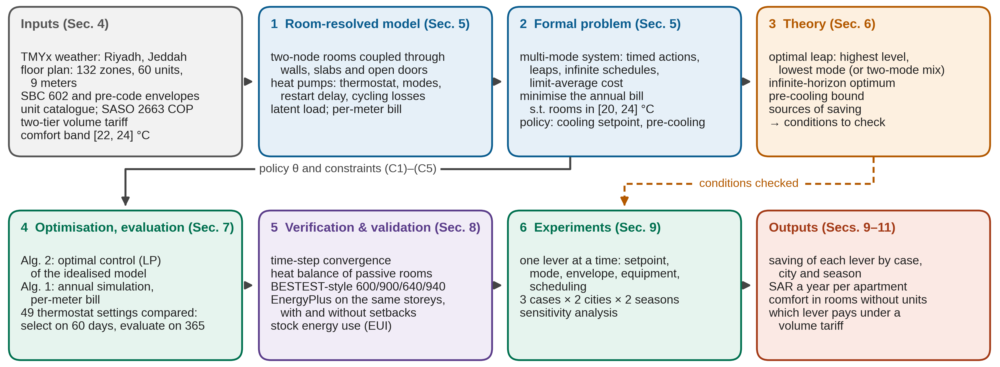
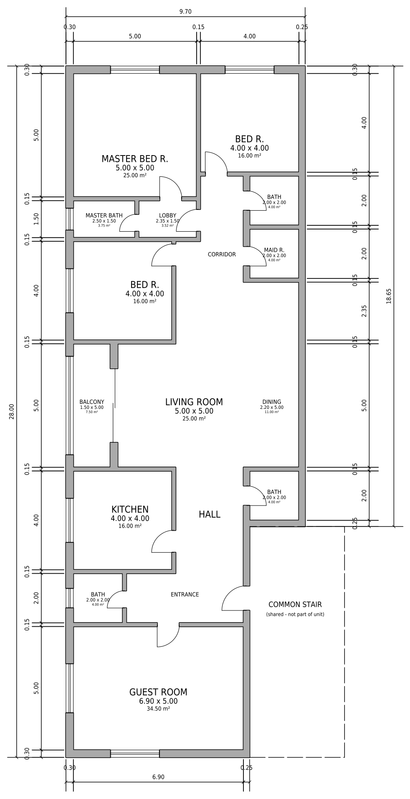
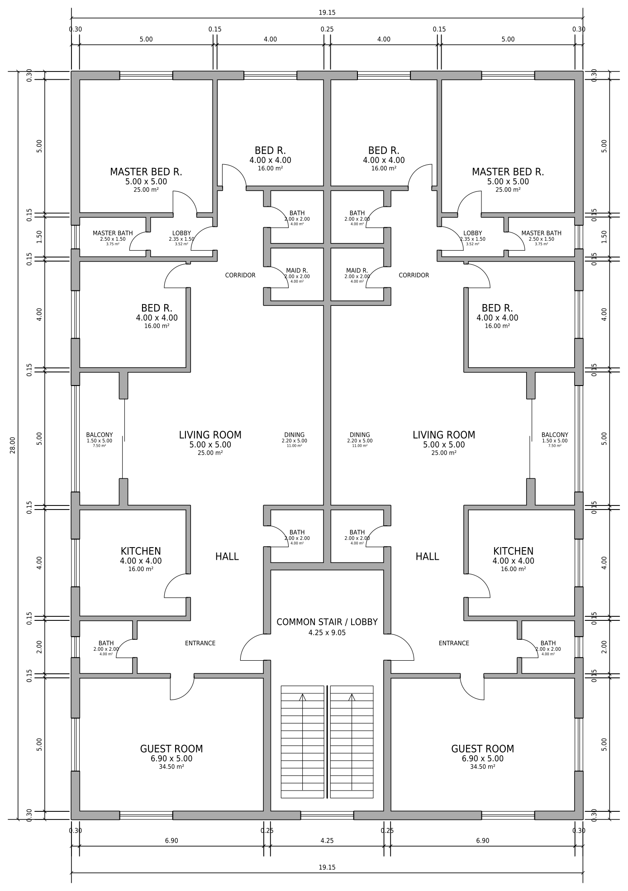
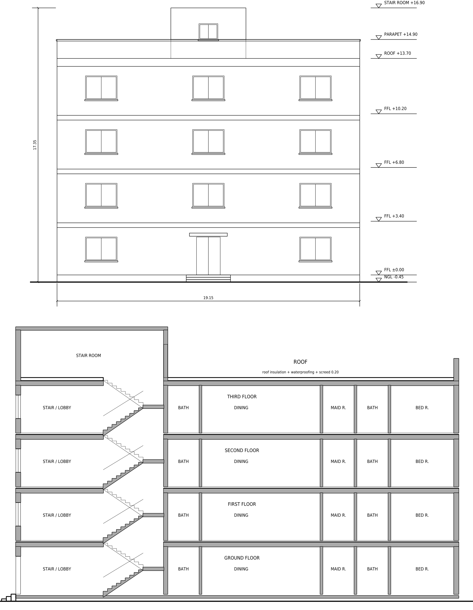

# Comfort-Constrained Operation of Multi-Mode HVAC in a Saudi Apartment Building under a Volume Tariff and Parameter Uncertainty

Code, drawings, simulation inputs, results and manuscript of the paper. Every result, table and figure of the
paper is regenerated from this repository, and the tests check the headline numbers against the paper.

| | |
|---|---|
| **Author** | Hamzah Faraj |
| **Affiliation** | Department of Sciences and Technology, Ranyah University College, Taif University, P.O. Box 11099, Taif 21944, Saudi Arabia |
| **Contact** | f.hamzah@tu.edu.sa |
| **ORCID** | [0009-0009-8832-0407](https://orcid.org/0009-0009-8832-0407) |
| **Paper** | [`paper/paper.pdf`](paper/paper.pdf) (LaTeX source: [`paper/main.tex`](paper/main.tex), [`paper/references.bib`](paper/references.bib)) |
| **Keywords** | optimal control; inverter heat pumps; setpoint; building envelope; pre-cooling; Saudi Building Code |
| **Funding** | Deanship of Graduate Studies and Scientific Research, Taif University |
| **Licence** | MIT ([`LICENSE`](LICENSE)) |
| **How to cite** | see [`CITATION.cff`](CITATION.cff) |

---

## Abstract
<!-- ABSTRACT:BEGIN -->
Heating, ventilation and air-conditioning (HVAC) dominates Saudi household electricity. We ask, by simulation, which lever lowers it in apartment buildings under the energy-only (volume) tariff households pay: setpoint, operating mode, envelope, equipment or timing. A four-storey building designed to the Saudi Building Code is modelled room by room, with coupled rooms, split heat pumps as installed, typical-year Riyadh and Jeddah weather and per-apartment meters, and compared with EnergyPlus. Every policy keeps each conditioned room's air within 20-24 °C, around the 22-24 °C comfort band. Against the pre-code envelope, the code envelope saves 38-56% of HVAC electricity. Raising the cooling setpoint from 22 to 23.5 °C saves 9.8-12.4%, net of the extra winter heating, and replacing the fixed-speed units with inverter units saves 11-15% on assumed part-load data. None of the 48 thermostat pre-cooling settings saves in the base model; pre-cooling by 2 K before the peak costs 3.4-4.3% (2.0-2.8% in the lowest mode). A perfect-foresight linear program bounds the saving of any periodic schedule of an idealised model on design days at 1.9% of sensible cooling electricity within the band and 3.6% down to 20 °C. Under an illustrative time-of-use tariff, pre-cooling saves 2-27%. A factorial decomposition of four levers ranks the envelope first and timing last, and a global uncertainty analysis of 17 assumed inputs (128 Latin-hypercube samples per city) preserves this ordering. The results assume an energy-only tariff, rooms occupied and conditioned at all hours, a hard ceiling with humidity priced but not constrained, and coverage-sized units.
<!-- ABSTRACT:END -->

**Keywords:** multi-mode systems; heat pumps; setpoint; building envelope; pre-cooling; Saudi Building Code

---

## Methodology


1. **Case study.** One four-storey apartment building (two mirror-image apartments of 230.8 m² per floor around a
   common stair), drawn by the author in AutoCAD to the Saudi Building Code (SBC) and generated from code
   ([`src/drawings/`](src/drawings)). It is analysed as three cases of increasing extent: **Case 1** one apartment,
   **Case 2** the typical floor, **Case 3** the whole building; in hot-dry **Riyadh** and hot-humid **Jeddah**,
   with the SBC envelope and with the pre-code envelope of the existing stock.

   | Case 1: apartment | Case 2: typical floor | Case 3: elevation and section |
   |---|---|---|
   |  |  |  |

2. **Room-resolved model** ([`src/hvac_savings/model.py`](src/hvac_savings/model.py)). Every room is a thermal
   zone with an air node and a structure node (ISO 13790 two-node simplification; 33 zones per floor, 132 in the
   building) on the wall centrelines of the drawings. Rooms exchange heat through walls and slabs (structure nodes)
   and open doors (buoyancy-driven exchange between air nodes); windows enter with their drawn size and orientation,
   with angle-dependent solar transmission, and roof, walls and windows lose long-wave heat to the sky (hourly EPW
   infrared). The uninsulated ground slab follows ISO 13370 with the monthly EPW ground temperature. Each apartment
   has seven split heat pumps from a product catalogue, modelled as installed: 1.5-2.5 t inverter units with three
   modes, fixed-speed 3-ton units that run on/off at full capacity (guest room, stair), thermostats with a 1 K
   differential and 0.5 K setpoint steps, a 3-minute restart delay, mode escalation with a full-capacity response
   when a room is past its switching point, cycling losses (part-load factor, Cd 0.15 / 0.25), 3 W standby and
   capacity derating; SASO 2663 efficiency, with the cooling COP depending on the outdoor and the indoor air. Measured TMYx weather, sensible and latent loads, 3-minute time step,
   one meter per apartment priced with the two-tier volume tariff of the Saudi Electricity Company
   (US$1 = SAR 3.75).
3. **Formal problem and theory.** The building is cast as a multi-mode system with limit-average costs (timed
   actions, leaps, infinite schedules). A theorem gives the optimal leap and infinite schedule (the highest cycle-mean
   level the comfort band allows, i.e. half the thermostat differential below the ceiling, in the lowest mode that
   holds the room, or a mix of the two modes that bracket the load), and propositions bound what any re-timing, such
   as pre-cooling, can gain under a tariff that prices energy alone. The heating setpoint is fixed at the comfort
   target (constraint C5); the decision variables are the cooling setpoint and the pre-cooling depths.
4. **Optimisation and evaluation.** One optimisation method: the bill-minimisation problem is solved as a
   perfect-foresight optimal-control linear program over every unit's heat removal at 15-min steps, with two-node
   rooms ([`experiments/optimiser/lower_bound.py`](experiments/optimiser/lower_bound.py); HiGHS interior point), for
   one apartment, the typical floor and the top floor under the roof, on design days and (apartment) on the whole of
   July as one horizon. With a COP of the outdoor air only (gamma = 0) its optimum is a rigorous upper bound on the
   saving of any schedule; with the engine's indoor COP factor (gamma = 0.02) sequential linear programming with a
   trust region, from two starts, finds the best valid schedule, an achievable saving. The 49 pre-cooling settings a thermostat with
   0.5 K steps can realise (night and pre-peak depths of 0-3 K) are evaluated by annual simulation and compared;
   settings that break the 24 °C ceiling are rejected. Selected on 60 sampled days, checked on the full year.
5. **Experiments.** Each lever (setpoint, operating mode, envelope, equipment, pre-cooling) is
   changed on its own against a stated baseline: three cases, two cities, two envelopes, two seasons, normal and
   hard (heat-wave) instances, a pre-specified dawn setback on all 365 days, an ablation of the selected policy,
   sensitivity to the equipment (incl. right-sized units), controller, zone model, envelope, weather and tariff, and
   an illustrative time-of-use tariff as a contrast.
6. **Verification and validation.** Physical consistency, time-step convergence and heat balance; BESTEST-style
   cases 600/900/640/940/600FF/900FF and the storey geometry, with and without 2 K setbacks, run in both this engine
   and EnergyPlus 26.1 on identical inputs ([`src/hvac_savings/comparative.py`](src/hvac_savings/comparative.py)); and the energy use of the Saudi
   housing stock. Absolute and relative errors are reported for every estimate.

---

## Key findings
<!-- HEADLINE:BEGIN -->
| | Riyadh | Jeddah |
|---|---|---|
| Best thermostat pre-cooling (49 policies), Cases 1-3, both envelopes | **0 %** | **0 %** |
| Extra cost of pre-peak / night pre-cooling, 2 K (Case 3) | +3.4 % / +4.6 % | +4.3 % / +5.3 % |
| Setpoint 22 -> 23.5 degC (Case 3) | 12.4 % | 10.5 % |
| SBC envelope vs pre-code stock (Case 3) | 56.4 % | 45.0 % |
| HVAC energy intensity, SBC / pre-code (kWh/m2/yr) | 25.1 / 57.5 | 37.7 / 68.5 |

Every conditioned room stays within 22-24 degC all year at the reference policy.
<!-- HEADLINE:END -->

### Findings by lever
<!-- FINDINGS:BEGIN -->
- **Setpoint level.** Moving from current practice (cooling at 22, heating at 20.5 °C) to the reference setpoints (23.5 and 22.5 °C) saves 12.2-12.4% of the HVAC energy in Riyadh and 9.8-10.5% in Jeddah across the three cases, 152-234 SAR a year per apartment. The saving comes from the cooling setpoint, about 9.4% (Riyadh) and 7.0% (Jeddah) per kelvin in the whole building, net of the 1.6% that heating to the comfort target adds in Riyadh. With a 1 K thermostat differential and 0.5 K steps, 23.5 °C is also the comfort frontier; only finer control would allow more.
- **Envelope.** The SBC envelope saves 50.4-56.4% (Riyadh) and 38.3-45.0% (Jeddah) of the HVAC energy of the same building with the pre-code envelope, 998-2,612 SAR a year per apartment.
- **Pre-cooling.** No thermostat pre-cooling policy pays under the volume tariff in the base model; in the sensitivity analysis the only exception, a one-node zone whose COP does not depend on the room temperature (two changes at once), saves at most 0.08%, and with every choice most favourable to pre-cooling combined the best policy saves 0.77% in Riyadh and 0.03% in Jeddah. Pre-peak pre-cooling by 2 K adds 3.4-4.3%, and still 2.9-3.8% if its extra heat is scaled to EnergyPlus. On the solved periodic design days no schedule of the idealised model could save more than 1.9% of the sensible cooling electricity within the band and 3.6% down to 20 °C (the upper bound with a COP that depends on the outdoor air only); with the engine's indoor COP factor the achievable saving, that of the best valid schedule found, is at most 0.6% within the band and 0.7% down to 20 °C, and a dawn setback fixed in advance on a simulated thermostat costs 0.99-1.80% (Case 3).
- **Equipment.** In the SBC-compliant building, units sized by load at 2.5 times the peak load, the first of the tested margins that keeps every room within the safe set, would use 11.2-16.5% less energy as inverter units, 0.2-2.1% of it from their size alone; replacing only the fixed-speed 3-ton units by inverter units saves 11.4-15.0%, and an indoor fan left running adds 11.8-14.7%.
- **Passive zones.** By holding their neighbours at the setpoint, with heat passing through walls and open doors, the controller removes 96% of the baths' excursion above the band; a small unit in each bath would remove the rest for 2.8-4.9% more energy (Appendix C).
<!-- FINDINGS:END -->

### Ablation of the recommended solution
<!-- ABLATION:BEGIN -->
*Table 11. Ablation of the selected policy θ\* (whole building, Case 3, volume tariff). Each variant changes one component and keeps the others, including the heating setpoint (which Algorithm [alg:eval] caps at 1 K below the cooling setpoint, so the current-practice row heats to 21 °C). Bill: annual HVAC bill (SAR); Δ: its change relative to θ\* [%]. All variants keep every conditioned room within the safe set (zero excursion above 24 °C and below 20 °C) and are therefore admissible. Lowest bill in bold.* ([`results/csv/tables/table_11_ablation.csv`](results/csv/tables/table_11_ablation.csv))

| Variant (changed component) | Riyadh: Bill | Riyadh: Δ | Jeddah: Bill | Jeddah: Δ |
|---|---|---|---|---|
| Selected policy θ\* (SBC) | 10,456 | - | 15,714 | - |
| Current-practice cooling (23.5->22 °C; heating 21 °C) | 11,968 | +14.5 | 17,551 | +11.7 |
| Inverter units in lowest mode (controller) | 10,424 | -0.31 | 15,709 | -0.03 |
| Highest mode (instead of the lowest) | 12,801 | +22.4 | 18,440 | +17.3 |
| Pre-code envelope (instead of SBC) | 23,994 | +129.5 | 28,566 | +81.8 |
| Night pre-cooling (2 K) | 10,934 | +4.6 | 16,542 | +5.3 |
| Pre-peak pre-cooling (2 K) | 10,811 | +3.4 | 16,390 | +4.3 |
<!-- ABLATION:END -->

---

## Limitations
- **Simulation only.** No apartment of the modelled building is metered; the engine is compared with EnergyPlus on
  identical inputs (BESTEST-style cases and the storey geometry) and with the stock energy use. Bills in SAR are
  indicative; the ordering of the levers and the relative savings are the robust results.
- **Model.** Two-node rooms (air and structure), no layered walls, reveal shading or curtains; the stair is a zone
  per storey. Equipment curves (mode part-load ratios, escalation thresholds, Cd, standby, derating) are nominal.
  Only a one-node zone whose COP ignores the room temperature lets a shallow pre-cool save, and then by 0.08 %;
  with every choice most favourable to pre-cooling combined the best policy saves at most 0.77 %. In Jeddah the units'
  sensible runtime alone does not hold the 9.6 g/kg humidity target; the latent term prices the extra
  dehumidification.
- **Sensitivity design.** Four layers: one-at-a-time runs (each assumption, including alternative models such as
  one or two nodes, unit type, controller resolution, ground and humidity models, heat wave and tariff, against the
  base case); a global uncertainty analysis that varies 17 continuous inputs **jointly** (Latin hypercube, 128 samples
  per city, partial rank correlations; blocks `uncertainty_*`, and `uq_envelope_all` for the envelope lever over all samples); the choices most favourable to pre-cooling combined in
  one run; and a 2^4 factorial of the levers with Shapley attribution (`factorial`). Not covered: the capacitance, the
  ground model and the weather year are varied only one at a time or not at all, and no variance-based (Sobol)
  indices are computed. Admissibility is also tested with a tolerance of 0.05-0.2 K on the safe set
  (`admissibility_tolerance`), and the setpoint lever is split into its cooling and heating parts (`setpoint_split`).
- **Scope.** One representative building, designed for the study; every room of every apartment occupied and
  conditioned at all hours (switching empty rooms off is future work); 49 uniform pre-cooling depth pairs in fixed
  windows for the thermostat search; the perfect-foresight benchmark covers arbitrary periodic schedules
  with idealised units on design days of every case (the whole building for the bound only) and the 31 days of July
  (one apartment). One typical weather year per city. Time-of-use and demand
  tariffs lie outside the theory.
- **Comfort and envelope.** Comfort is the air temperature against a fixed 22-24 °C band (the operative temperature
  is estimated separately). "SBC-compliant" refers to walls, roof and glazing; slabs and partitions keep the
  values of the existing stock and the ground slab is uninsulated.

**Future work:** closed-loop predictive or learning-based control; occupancy-based operation with measured routines
and vacant apartments; a coupled coil moisture model; a room-by-room EnergyPlus model; multi-year weather; PMV comfort; time-of-use tariffs; villas and
mixed stocks; field evaluation.

---

## Conclusion
<!-- CONCLUSION:BEGIN -->
We asked how much the operation of multi-mode heat pumps can save in a Saudi apartment building under the volume tariff, and which lever produces the saving. The theory shows that, without re-timing, the cheapest policy holds every room at the top of the comfort band in the lowest mode that holds the room (or a mix of the two modes that bracket its load), and bounds what pre-cooling can gain under any energy-only tariff. The room-resolved simulations of one apartment, one floor and the whole building in Riyadh and Jeddah give the following results (Tables 6 and 8) give the findings listed under Key findings above.

The operating mode is set by the controller, not the household, and holding the highest mode costs more (Table 11). The four levers of the factorial together lower the building's annual HVAC bill from 26,788 to 8,889 SAR in Riyadh and from 33,616 to 13,924 SAR in Jeddah; a factorial decomposition on that base places the envelope first and timing last among them (Table 12), where timing's share is the penalty avoided by dropping the pre-cooling of the start state. A global uncertainty analysis of 17 assumed inputs leaves that ordering unchanged in all its 2x128 samples, including those in which the pre-code comparison leaves the safe set, and none of the pre-cooling settings tested saves in any of them (Table 15). For one building designed to the code, the findings separate the levers (G1), test re-timing against the tariff households pay (G2) and rest on a code-based model (G3); they are conditional on an energy-only tariff, every room occupied and conditioned at all hours (occupancy-based operation is outside the study), a hard 24 °C ceiling on the air temperature of the conditioned rooms, humidity priced but not constrained, and catalogue units sized by coverage; the uncertainty analysis varies inputs, not these conditions. Within these conditions, the implications for Saudi households and code bodies are to (1) improve the envelope, above all under the roof, where the top-floor apartments carry the largest envelope penalty; (2) size units by load only with a switch-on point below the ceiling (a 23 °C setpoint was tested; Section 9.5); (3) raise the cooling setpoint from 22 to 23.5 °C, with the heating setpoint held at the comfort target; (4) not pre-cool under the volume tariff; and (5) where the unit allows it, let the indoor fan stop with the compressor. Moving cooling in time pays substantially only under a tariff that prices the time of use or the peak (Section 9.7).
<!-- CONCLUSION:END -->

---

## Repository layout
```
saudi-hvac-savings/
├── README.md  LICENSE  CITATION.cff  CHANGELOG.md  CONTRIBUTING.md
├── pyproject.toml            package `hvac-savings` and its commands
├── requirements.txt          numpy, matplotlib
├── requirements-dev.txt      pytest
├── requirements-drawings.txt ezdxf, shapely, pymupdf (drawing set only)
├── Makefile                  results | optimise | benchmark | benchmark-parse | drawings | figures | csv | paper | test | reproduce
│
├── paper/                    the manuscript
│   ├── paper.pdf             compiled paper
│   ├── main.tex              complete LaTeX source in one file
│   └── references.bib        bibliography
│
├── figures/                  every figure: fig_*.pdf (vector, used in the paper) and fig_*.png (previews)
│
├── src/                      code
│   ├── hvac_savings/         the model and the analysis pipeline (Python package)
│   │   ├── model.py          geometry, weather, two-node room dynamics (walls, slabs, doors), units as installed,
│   │   │                     thermostats, tariff, meters
│   │   ├── reproduce.py      62 resumable analysis blocks -> results/parts/*.json, results/results.json
│   │   ├── energyplus.py     EnergyPlus storey-box model: writes the IDFs, runs EnergyPlus, parses the outputs
│   │   ├── comparative.py    like-for-like comparison with EnergyPlus: storey box and BESTEST-style 600/900
│   │   └── figures.py        every data-driven figure -> figures/
│   ├── drawings/             the building drawn in code
│   │   ├── make_dxf.py, make_dxf_single.py, make_building.py   -> Floor_Layout.dxf, Apartment_Single.dxf, Building_4_Floors.dxf
│   │   ├── export_pdf.py     1:100 vector PDF sheets of the three DXF files
│   │   ├── make_figure_panels.py   the three panels of Fig. 3 -> figures/fig_cad_*.pdf/.png
│   │   └── *.dxf, *.pdf      the generated drawing set
│   └── paper_tools/
│       └── export_csv.py     every paper table and result block as CSV -> results/csv/
│
├── experiments/              simulation inputs and optimisers
│   ├── optimiser/
│   │   ├── optimiser.py      Algorithm 1 (policy evaluation), Algorithm 2 (comparison of the 49 thermostat policies)
│   │   └── lower_bound.py    perfect-foresight linear program over arbitrary schedules (two-node rooms)
│   ├── configs/
│   │   ├── building.json     rooms, clear sizes, windows, doors and openings, units, meters (from the drawings)
│   │   ├── parameters.json   physics, plant (modes, COP), tariff, gains, solar, numerics, with sources
│   │   ├── climate.json      weather file and ground temperature per city
│   │   └── experiments.json  run matrix: policy lattice, sweeps, sizing margins
│   ├── weather/              measured TMYx EPW files (Riyadh 404380, Jeddah 410240)
│   └── energyplus/<case>/in.idf    EnergyPlus inputs: storey box (4 runs) and BESTEST-style cases (4 runs)
│
├── results/                  simulation outputs
│   ├── results.json          merged results of all blocks
│   ├── parts/                one JSON per analysis block
│   ├── csv/
│   │   ├── tables/           table_NN_<name>.csv: every table of the paper, as printed
│   │   └── blocks/           <block>.csv: every analysis block flattened to key,value rows
│   ├── energyplus/<case>/    EnergyPlus outputs (eplusout.eso/.err, ...)
│   ├── comparative.json      EnergyPlus comparison (storey box, BESTEST-style)
│
└── tests/test_reproduction.py   tests: geometry vs drawings, engine and equipment, theorems, passive rooms,
                                 enumeration, benchmark, setback validation, tenants, sensitivity, equipment split, headline numbers (tests/pinned.json)
```

### Paper figures
| Fig. | File in `figures/` | Generated by |
|---|---|---|
| 1 | `fig_pipeline` | `hvac_savings.figures.fig_pipeline` |
| 2 | `fig_weather` | `hvac_savings.figures.fig_weather` (TMYx files) |
| 3a-c | `fig_cad_apartment`, `fig_cad_floor`, `fig_cad_elevation` | `src/drawings/make_figure_panels.py` |
| 4 | `fig_defs` | `hvac_savings.figures.fig_defs` (schematic) |
| 5 | `fig_epcompare` | `hvac_savings.figures.fig_epcompare` (`comparative.json`) |
| 6 | `fig_leap` | `hvac_savings.figures.fig_leap` (`running_example`) |

`fig_hierarchy` (the three-case table as bars), `fig_layouts`, `fig_building`, `fig_floors`, `fig_monthly`, `fig_humidity`, `fig_landscape` (cost surface) are supplementary (zone model of the plan, plan and
section, energy by storey, monthly energy) and not used in the paper.

### Paper tables
Every table of `paper/main.tex` is exported, as printed, to `results/csv/tables/table_NN_<name>.csv` (NN = table number in the paper).
Six tables that the paper summarises in text are kept here instead of in the paper, in `results/csv/repository/`
(LaTeX source `paper/repository_tables.tex`): `lower_bound_all_design_days.csv` (benchmark on every design day, Appendix D),
`sensitivity_all_variants.csv` (all 37 sensitivity variants, Appendix H), `test_instances_all.csv` (every test instance, Appendix H),
`uncertainty_prcc.csv` (partial rank correlations, Appendix I), `weather_monthly.csv` (monthly weather and ground temperature, Appendix E) and `calculation_time.csv` (measured calculation times, Section 9.6).
Two derived values the paper reports are stored in `results/derived/`: `energyplus_scaled_precool.json` (pre-cooling cost with EnergyPlus's extra heat, Appendix H) and `lower_bound_season.json` (the season values of the benchmark, Table 10).
The analysis block behind each result:

| Paper item | Block (results/parts/<block>.json) |
|---|---|
| Table of the three cases | `scopes_Riyadh`, `scopes_Jeddah` |
| Comfort frontier (thermostat steps; fine thermostat) | `setpoint_frontier`, `revision` |
| Normal / hard instances; comfort frontier of tightly sized units; floor guard on/off | `instances`, `tight_frontier`, `floor_guard` |
| Seasons table (heating, cooling, modes); seasonal levers | `seasons_hc`, `operations`, `seasonal_levers` |
| Training and evaluation (60 -> 365 days); full-year lattice | `train_eval`, `precool_fullyear` |
| Calculation-time table | `complexity`, `inference`, `lp_complexity` |
| Running example (Bed 2; leap figure) | `running_example` |
| Passive-zone heat budget (running example, baths) | `passive_zone` |
| Neighbours (running example); party wall | `party_wall` |
| HVAC intensity by storey; latent load; tier check | `stage1`, `humidity` |
| Passive rooms; thermal shift; baths with units | `rooms`, `wet_neighbours`, `passive_control` |
| Ablation table (one component of the selected policy changed at a time) | `ablation` |
| Pre-cooling features; why pre-cooling fails (heat vs COP); peak demand | `scheduling_*`, `precool_decomposition` |
| Bill and savings per apartment (8 apartments) | `tenant_savings` |
| Perfect-foresight benchmark (per scope: `lower_bound_apartment`, `lower_bound_floor`, `lower_bound_top_floor`; `lower_bound` merges them) and its checks | `lower_bound`, `lower_bound_checks` |
| Sensitivity table (inputs, zone model, equipment, controller, envelope, air, weather) | `robustness`, `robustness_extra`, `revision` |
| Equipment by unit type; sizing margin vs comfort; humidity per lever | `equipment_split`, `sizing_margin`, `humidity_levers` |
| Appendix: robustness of the pre-cooling result (lowest mode, ramp, dawn setback, EnergyPlus-scaled heat, top floor / west rooms, controller resolution, favourable choices combined, safe floor) | `precool_decomposition`, `dawn_setback`, `precool_targeted`, `controller_resolution`, `joint_favourable`, `safe_floor`, `comparative` |
| Thermal mass; COP swing | `mass_0.8`, `mass_1.5`, `mass_2.5`, `cop_swing` |
| Cost model; time-of-use contrast | `cost_model`, `tou` |
| Cost surface | `landscape` |
| Physical and numerical verification | `verification` |
| EnergyPlus comparison (BESTEST-style; storey box); stock energy use | `comparative`, `stock_equivalent` |
| Factorial lever decomposition (Shapley); global uncertainty analysis (Latin hypercube, PRCC) | `factorial`, `uncertainty_Riyadh`, `uncertainty_Jeddah` |
| Room schedule; monthly weather and ground temperature (Appendix E) | `experiments/configs/building.json`, `experiments/weather/` (no block) |

---

## Quick start
```bash
pip install -e .[dev]            # the hvac_savings package and its commands
make test                        # reproduction tests
make paper                       # compile paper/main.tex -> paper/paper.pdf
make optimise                    # compare the 49 thermostat policies (experiments/optimiser/)
make csv                         # export all tables and results as CSV -> results/csv/
make figures                     # data-driven figures -> figures/
make drawings                    # DXF drawing set and Fig. 3 panels (pip install -r requirements-drawings.txt)
make benchmark-parse             # rebuild the EnergyPlus comparison from the stored runs (no EnergyPlus needed)
make benchmark                   # rerun the EnergyPlus 26.1 comparison (needs ENERGYPLUS_DIR)
make results                     # rerun every analysis block (resumable)
make reproduce                   # everything from scratch: results, EnergyPlus parse, drawings, figures, paper, CSV, tests
```
`hvac-reproduce --list` shows the status of every block; `--blocks name1,name2` runs selected blocks and
`--force` recomputes them. Blocks write `results/parts/<block>.json`; `results/results.json` merges them.
The long blocks are the test instances, the full-year lattice, the perfect-foresight benchmark and the sensitivity
blocks; a full run takes several hours on a two-core machine.

---

## Data and code availability
Everything needed to regenerate every number, table and figure of the paper, including its appendices, is in this
repository:

| What | Where |
|---|---|
| Simulation engine, 62 resumable analysis blocks, perfect-foresight benchmark, EnergyPlus driver, figure and CSV export | `src/hvac_savings/`, `experiments/optimiser/`, `src/paper_tools/` |
| Building geometry, parameters (each with its source), experiment matrix, climates | `experiments/configs/*.json` |
| Weather: TMYx typical years assembled from measured records (Riyadh 404380, Jeddah 410240), as downloaded from [Climate.OneBuilding.Org](https://climate.onebuilding.org/WMO_Region_2_Asia/SAU_Saudi_Arabia/index.html): [Riyadh](https://climate.onebuilding.org/WMO_Region_2_Asia/SAU_Saudi_Arabia/RI_Riyadh/SAU_RI_Riyadh.AB.404380_TMYx.zip), [Jeddah](https://climate.onebuilding.org/WMO_Region_2_Asia/SAU_Saudi_Arabia/MK_Makkah/SAU_MK_Jeddah-Abdulaziz.Intl.AP.410240_TMYx.zip) | `experiments/weather/` |
| Floor plans and elevation (DXF and PDF) and the scripts that draw them | `src/drawings/` |
| EnergyPlus models (storey box, BESTEST-style cases, setback tests) and their outputs | `experiments/energyplus/`, `results/energyplus/` |
| Every analysis result, one JSON file per block, every paper table as CSV, and the six tables kept out of the paper | `results/parts/`, `results/results.json`, `results/csv/` (`tables/`, `repository/`, `blocks/`) |
| Uncertainty analysis: all 256 Latin-hypercube samples (inputs and results), one line per sample | `results/cache/uq_*.jsonl`, `results/parts/uncertainty_*.json` |
| Perfect-foresight benchmark: every solve (bound and search), per scope | `results/cache/lower_bound_*.json` |
| Manuscript (single-file LaTeX, references, PDF). Appendices: A nomenclature; B proofs; C passive zones; D full perfect-foresight benchmark; E geometry, list of rooms (areas, windows, units, gain factors) and weather with ground temperature; F formal definitions and running examples; G validation details; H full sensitivity analysis and pre-cooling robustness; I uncertainty analysis | `paper/` |
| Tests | `tests/` |

## Use of generative AI
Claude (Anthropic) was used to assist with code development, structuring and language editing. All model design,
results, validation and interpretation were carried out without it, and the author takes full responsibility for
the content.

## Licence
MIT, see [`LICENSE`](LICENSE).
